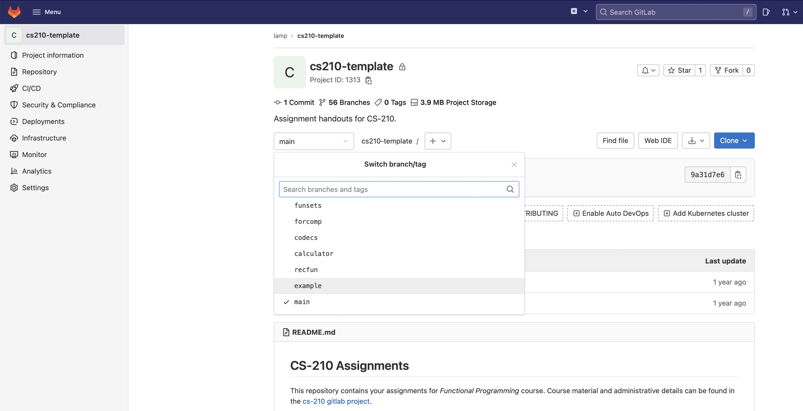

# CS-210 Assignments

Welcome! This git repository contains your assignments for the *Functional Programming* course.

Course material and administrative details can be found on the [Moodle page](https://moodle.epfl.ch/course/view.php?id=14257). More information on grading, Git and Gitlab can be found in [“Grading and Submission”](https://lampepfl.github.io/cs210/grading-and-submission).

## How to see files for a specific assignment

To select a branch, click on the "main" dropdown menu (under the project description):

